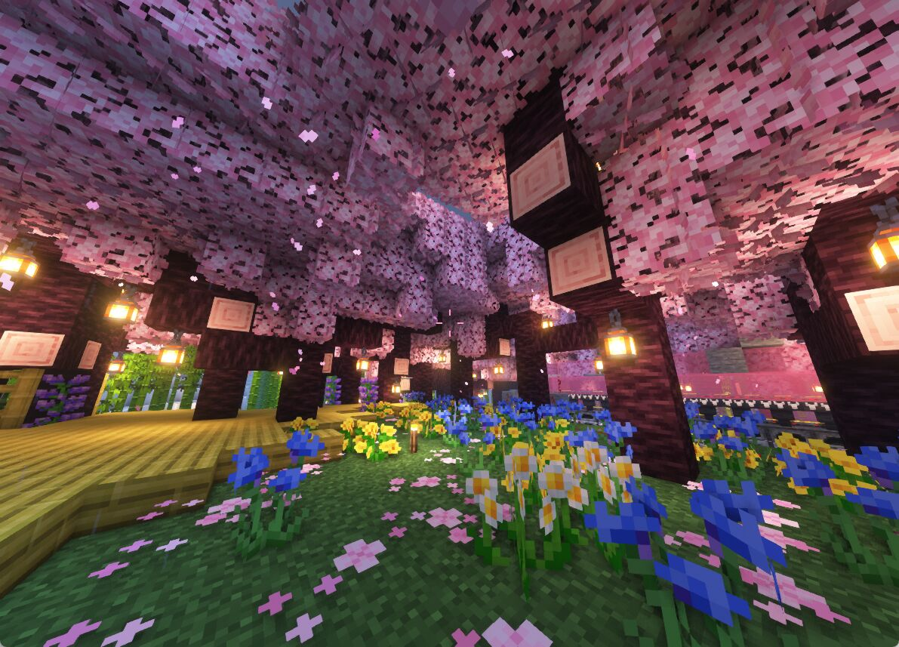
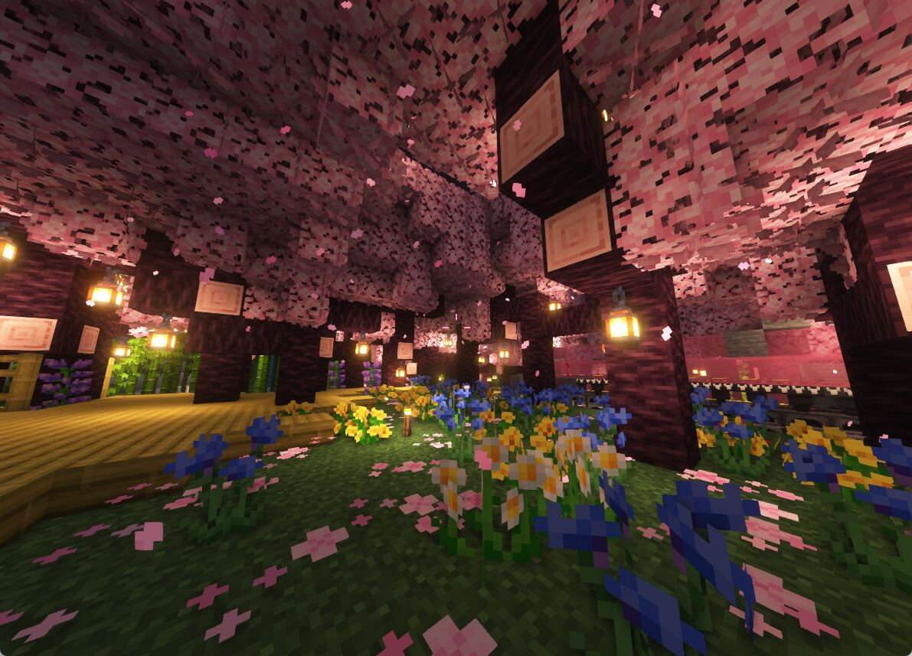
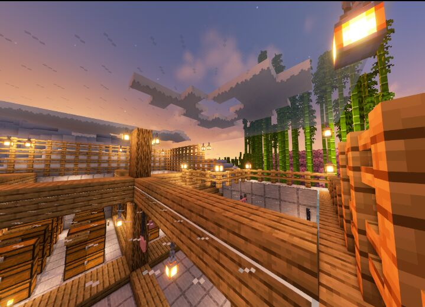
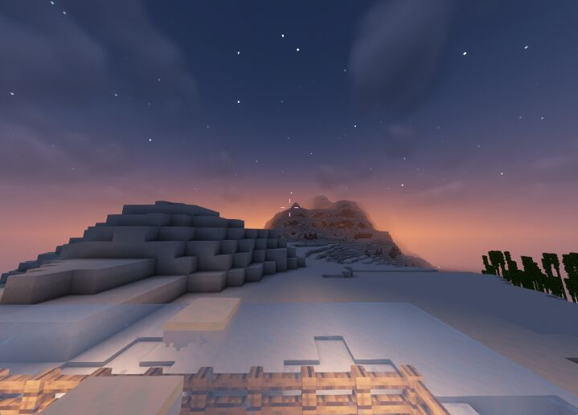
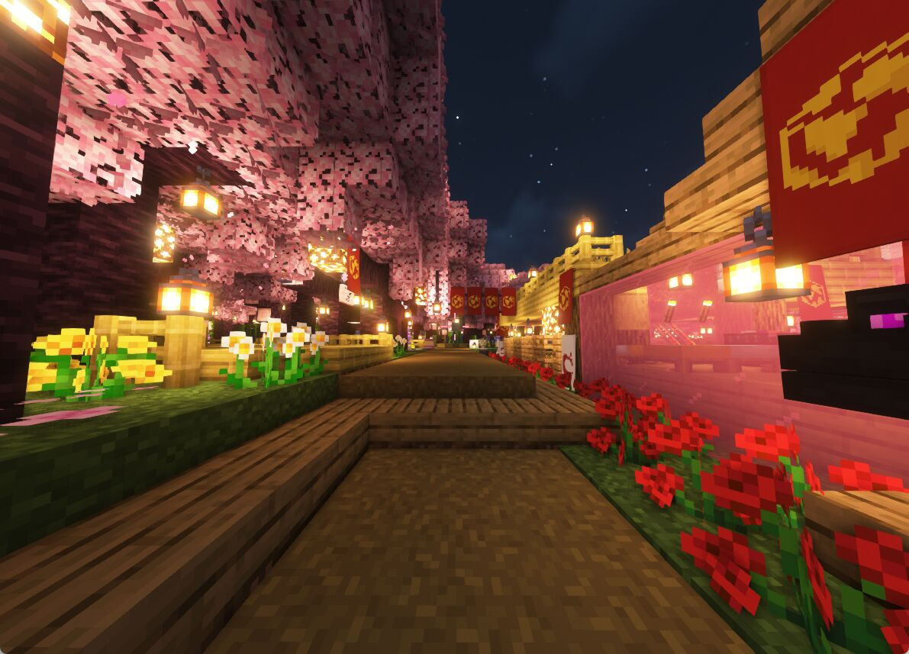
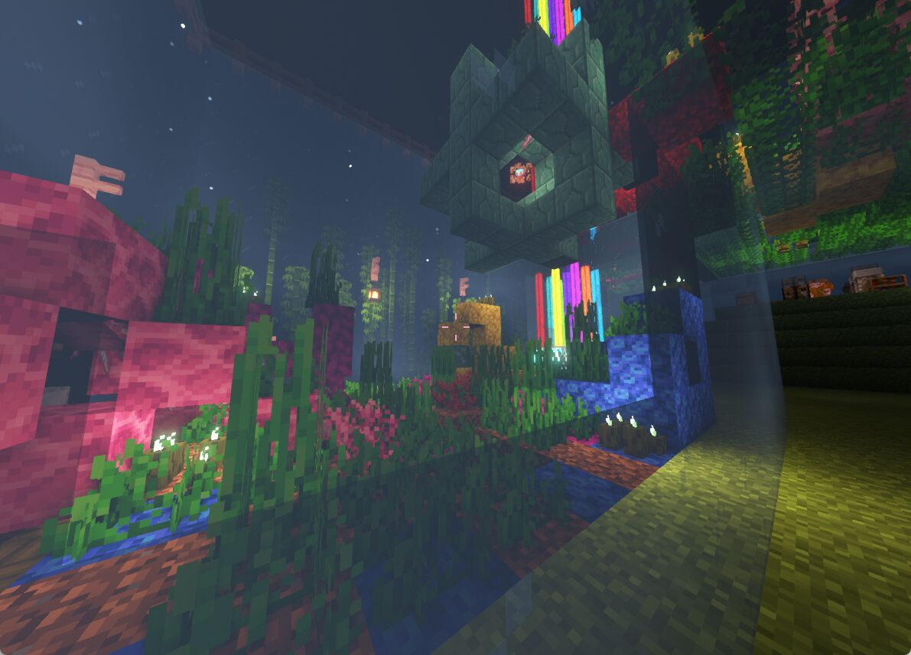
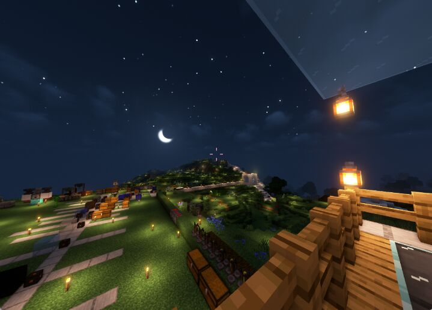

# 服务器景观

## 中星坛

### 日间

<figure><figcaption>
中星坛_早
</figcaption></figure>

### 夜间

<figure><figcaption>
中星坛_晚
</figcaption></figure>

## 仓库

<figure><figcaption>
仓库_早
</figcaption></figure>

## 雪山

<figure><figcaption>
雪山_晚
</figcaption></figure>

## 桃源道

<figure><figcaption>
桃源道_晚
</figcaption></figure>

## 水族馆

<figure><figcaption>
水族馆-晚
</figcaption></figure>

## 工业区

<figure><figcaption>
工业区_晚
</figcaption></figure>
